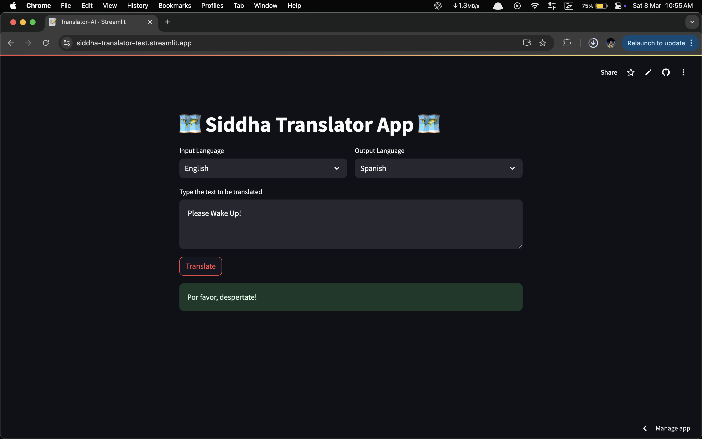
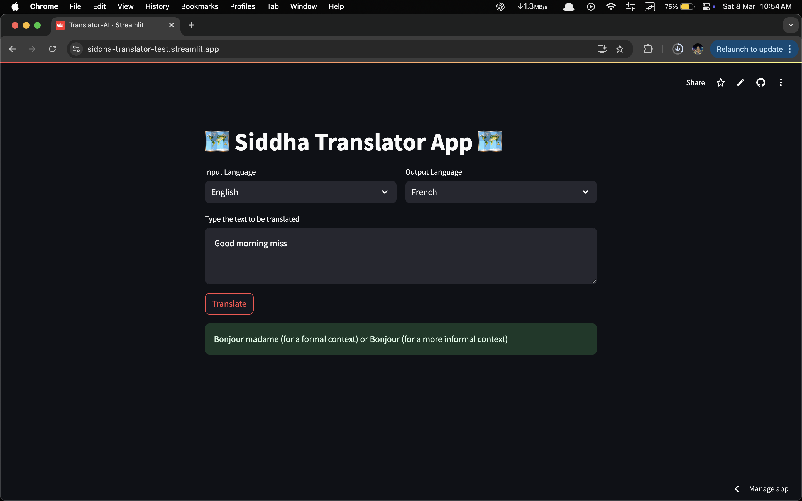

## 🌍 Siddha Translator App 🌍

Siddha Translator App is a simple and interactive language translation web app built using Streamlit and Google Translate API. It allows users to translate text between multiple languages with an easy-to-use interface.

## Features
	•	Translate text between various languages
	•	User-friendly UI with a dark theme
	•	Supports multiple input and output languages
	•	Powered by Google Translate API

## Technologies Used
	•	Python
	•	Streamlit
	•	Mistral AI API

## Usage
	1.	Select the Input Language and Output Language.
	2.	Enter the text you want to translate.
	3.	Click the Translate button to see the translated output.

## Deployment

The app is deployed on Streamlit Cloud. You can access it here.

## Screenshot
 

 

## Contributing

Feel free to submit issues or pull requests to improve the project!
